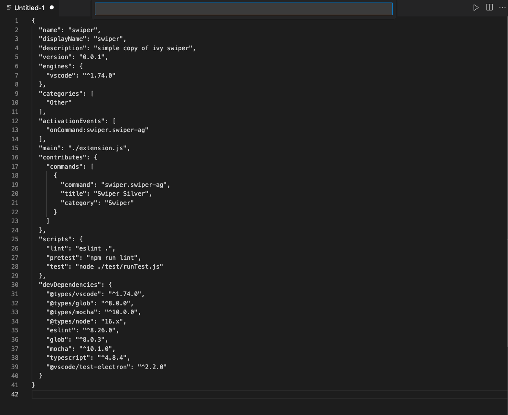

# swiper

a dumb copycat of emacs swiper. Support search regex string in the current open window.

> I only tested this on my macOS, Please file bug report or feature request.

> This swiper does not match multiline (yet...)



## Installation

install this extension,

## Quick tutorial

Invoke command `Swiper: Swiper Silver` and start typing.

default case insensitive search.

Remember to escape common regex character e.g. `\[` , `\.`

Some quick Example:

```sh
# search widecard 
command.*swiper 
# lint OR display 
lint|display
# line starts with test 
^test
```

## Behind the scene

This extension is a simple wrapper of the CLI `ag`, it relays user input to `ag` and read its output.

## TODO

- [ ] search all file in the workspace.  
- [ ] somehow test on non-macOS?
- [ ] maybe multiline search support
